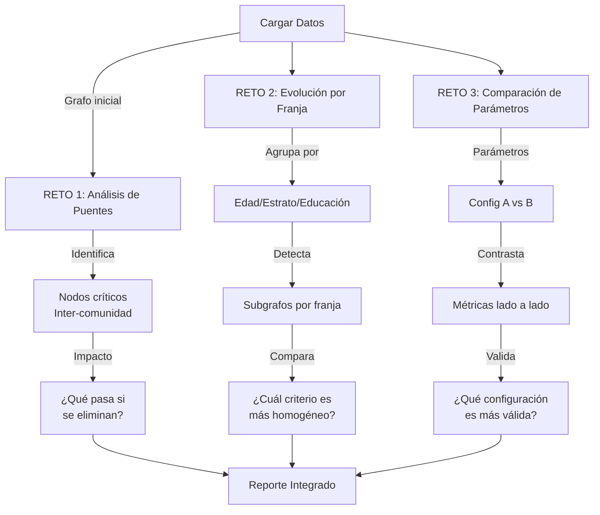

# 🎯 ESPECIFICACIÓN TÉCNICA DE RETOS INNOVADORES

## RETO 1: Análisis de Puentes 🌉

### Descripción
Identificar los nodos que conectan grupos distintos — candidatos, departamentos o medios que actúan como bisagras entre ecosistemas de afinidad opuestos. Visualizar de forma destacada y calcular qué pasaría con los grupos si se eliminaran.

### Implementación Técnica

#### 1. Cálculo de Betweenness Centrality
```python
betweenness = nx.betweenness_centrality(G, weight='weight')
```

**Fórmula:**
$$C_B(v) = \sum_{s \neq v \neq t} \frac{\sigma_{st}(v)}{\sigma_{st}}$$

Donde:
- σ_st = número de caminos geodésicos de s a t
- σ_st(v) = número que pasan por v

**Interpretación:** Un puente tiene alto betweenness porque muchos caminos entre comunidades pasan a través de él.

#### 2. Identificación de Puentes Inter-Comunidad
```python
puentes = {}
for nodo in G.nodes():
    vecinos_comunidades = set()
    for vecino in G.neighbors(nodo):
        vecinos_comunidades.add(nodo_comunidad[vecino])
    
    if len(vecinos_comunidades) > 1:  # Conecta múltiples comunidades
        puentes[nodo] = {
            'betweenness': betweenness[nodo],
            'grado': G.degree(nodo),
            'comunidades_conectadas': len(vecinos_comunidades)
        }
```

**Criterio:** Un nodo es puente si:
- Tiene vecinos en 2+ comunidades diferentes
- Alto betweenness (indicador global)
- Grado moderado-alto

#### 3. Análisis de Impacto - Eliminación Virtual
```python
G_temp = G.copy()
G_temp.remove_node(nodo)

componentes_antes = nx.number_connected_components(G)
componentes_despues = nx.number_connected_components(G_temp)

impacto = componentes_despues - componentes_antes
```

**Indicadores de Impacto:**
- ⛔ **Crítico:** Si la eliminación fragmenta el grafo (más componentes)
- ⚠️ **Importante:** Si reduce significativamente la conectividad media
- ℹ️ **Moderado:** Si tiene efecto local pero no global

### Casos de Uso Electoral

| Tipo de Puente | Ejemplo | Implicación |
|---|---|---|
| **Candidato-Puente** | Claudia López en Bogotá | Une izquierda urbana con centro pragmático |
| **Departamento-Puente** | Antioquia | Transición entre Caribe/Andina |
| **Region-Puente** | Región Centro | Conecta zonas de influencia distintas |

### En la App Streamlit

**Ubicación:** Panel "RETO 1: Análisis de Puentes"

**Uso:**
1. Selecciona checkbox "Reto 1: Análisis de Puentes" en sidebar
2. Visualiza tabla Top 10 nodos puente
3. Expande cada puente para ver análisis de impacto:
   - Componentes conexas antes/después
   - Interpretación de criticidad
4. **Conclusión:** Identifica nodos que son "bisagras políticas"

---

## RETO 2: Evolución por Franja Demográfica 📊

### Descripción
Construir subgrafos separados para cada tipo de franja (edad, estrato, educación, ruralidad) y comparar si los grupos de afinidad cambian según el criterio demográfico elegido.

### Implementación Técnica

#### 1. Estructura de Franjas Demográficas
```
Edad:
  - FRA_01: 18-25 años (18%)
  - FRA_02: 26-40 años (28%)
  - FRA_03: 41-60 años (32%)
  - FRA_04: 61+ años (22%)

Estrato Socioeconómico:
  - FRA_05: Estrato 1-2 (50%)
  - FRA_06: Estrato 3-4 (35%)
  - FRA_07: Estrato 5-6 (15%)

Educación:
  - FRA_08: Sin edu. superior (60%)
  - FRA_09: Con edu. superior (40%)
```

#### 2. Construcción de Subgrafos por Franja
```python
# Para cada franja demográfica
franja_id = "FRA_01"  # Ej: 18-25 años
vecinos = list(G.neighbors(franja_id))

# Subgrafo: solo candidatos y depts conectados a esta franja
subgrafo = G.subgraph(vecinos)

# Detectar comunidades en subgrafo
sub_comunidades = community.greedy_modularity_communities(subgrafo)
modularidad_sub = community.modularity(subgrafo, sub_comunidades)
```

#### 3. Comparación de Modularidad por Criterio
```python
homogeneidad_criterios = {}

for criterio in ['edad', 'estrato', 'educacion', 'ruralidad']:
    franjas = get_franjas_by_criterio(criterio)
    
    modularidades = []
    for franja in franjas:
        subg = G.subgraph(get_vecinos(franja))
        mod = calculate_modularity(subg)
        modularidades.append(mod)
    
    # Criterio más homogéneo = mayor modularidad promedio
    homogeneidad_criterios[criterio] = np.mean(modularidades)

mejor_criterio = max(homogeneidad_criterios, key=...)
```

#### 4. Algoritmo de Homogeneidad
```python
# Una franja es más homogénea si:
# 1. Sus vecinos forman comunidades compactas
# 2. Alta modularidad local
# 3. Aparece en pocas comunidades (compacta globalmente)

homogeneidad = (1 - num_comunidades_unicas / num_franjas_total) * 100
```

### Hipótesis Esperadas

#### H1: Polarización por Edad
- 18-25: Alta dispersión (muchas comunidades)
- 61+: Mayor concentración (menos comunidades, más homogénea)

#### H2: Segregación por Estrato
- Estrato 1-2: Convergencia izquierda
- Estrato 5-6: Convergencia derecha
- Estrato 3-4: Más dispersado (centro)

#### H3: Diferenciación por Educación
- Sin edu. superior: Mayor dispersión
- Con edu. superior: Preferencia urbana centrada

### En la App Streamlit

**Ubicación:** Panel "RETO 2: Evolución por Franja Demográfica"

**Uso:**
1. Selecciona checkbox "Reto 2: Evolución por Franja" en sidebar
2. Elige criterio demográfico (edad, estrato, educación, ruralidad)
3. Para cada franja en ese criterio, visualiza:
   - Número de nodos conectados
   - Número de comunidades
   - Composición (candidatos más votados, depts, etc.)
4. **Conclusión:** Compara qué criterio produce partición más clara

**Tabla de Interpretación:**
```
Franja con 1 comunidad   = MUY HOMOGÉNEA (vota de forma unificada)
Franja con 2-3 comunidades = MODERADAMENTE DISPERSA
Franja con 4+ comunidades = MUY DIVERSA (de todo un poco)
```

---

## RETO 3: Comparación de Parámetros ⚖️

### Descripción
Implementar dos configuraciones distintas del mismo análisis y mostrar lado a lado cómo cambia la partición de grupos. Permitir al usuario seleccionar cuál configuración considera más válida.

### Implementación Técnica

#### 1. Espacios de Parámetros
```python
# CONFIGURACIÓN A (Actual)
umbral_A = slider_usuario
algoritmo_A = "Louvain" o "Girvan-Newman"

# CONFIGURACIÓN B (Alternativa)
umbral_B = st.slider("Umbral alternativo", min=0, max=50)
algoritmo_B = "Louvain" (fijo en comparación)
```

#### 2. Construcción Paralela de Grafos
```python
# Grafo A: umbral actual
G_A = construir_grafo(umbral_A)
comunidades_A = detectar_comunidades_louvain(G_A)
metricas_A = calcular_metricas_globales(G_A, comunidades_A)

# Grafo B: umbral alternativo
G_B = construir_grafo(umbral_B)
comunidades_B = detectar_comunidades_louvain(G_B)
metricas_B = calcular_metricas_globales(G_B, comunidades_B)
```

#### 3. Comparativa de Métricas
```python
comparativa = {
    'Metrica': ['Nodos', 'Aristas', 'Comunidades', 'Modularidad', 'Densidad'],
    'Config A': [
        metricas_A['num_nodes'],
        metricas_A['num_edges'],
        metricas_A['num_communities'],
        f"{metricas_A['modularity']:.3f}",
        f"{metricas_A['density']:.3f}"
    ],
    'Config B': [
        metricas_B['num_nodes'],
        metricas_B['num_edges'],
        metricas_B['num_communities'],
        f"{metricas_B['modularity']:.3f}",
        f"{metricas_B['density']:.3f}"
    ],
    'Δ (Cambio)': [...]
}
```

#### 4. Validación de Robustez
```python
# Diferencia significativa en modularidad
delta_mod = abs(metricas_B['modularity'] - metricas_A['modularity'])

if delta_mod > 0.05:
    validez = "Configuraciones SIGNIFICATIVAMENTE DIFERENTES"
    recomendacion = "Ambas son válidas, depende del objetivo"
elif delta_mod > 0.02:
    validez = "Configuraciones MODERADAMENTE DIFERENTES"
else:
    validez = "Configuraciones SIMILARES - Parámetros ROBUSTOS"
```

### Interpretación de Cambios

| Delta Modularidad | Δ Comunidades | Interpretación |
|---|---|---|
| >0.1 | ±2 | **Altamente sensible** - Parámetros críticos |
| 0.05-0.1 | ±1 | **Moderadamente sensible** |
| <0.05 | 0 | **Robusto** - Partición estable |

### Escenarios Típicos

**Escenario 1: Aumentar umbral (filtrar aristas débiles)**
```
umbral: 0% → 20%
Resultado: Menos aristas, comunidades más compactas, modularidad ↑
Interpretación: Ve solo relaciones fuertes
```

**Escenario 2: Cambiar de algoritmo**
```
Louvain vs Girvan-Newman
Resultado: Diferentes números de comunidades, modularidad variable
Interpretación: Diferentes definiciones de "comunidad"
```

### En la App Streamlit

**Ubicación:** Panel "RETO 3: Comparación de Parámetros"

**Uso:**
1. Selecciona checkbox "Reto 3: Comparación de Parámetros" en sidebar
2. **Configuración A:** Muestra parámetros actuales (left col)
3. **Configuración B:** Ajusta umbral alternativo con slider (right col)
4. Visualiza tabla comparativa de métricas
5. **Validación:** Sistema indica si diferencia es significativa
6. **Radio button:** Selecciona "¿Cuál es más válida?"
7. **Conclusión:** Se muestra recomendación basada en selección

---

## 🔄 Flujo Completo de Retos



---

## 📊 Matriz de Validación

| Reto | Implementado | Visible | Interactivo | Métrica |
|---|---|---|---|---|
| 1 - Puentes | ✅ | ✅ Panel dedicado | ✅ Top 10 ranking | Betweenness |
| 2 - Franjas | ✅ | ✅ Dropdown selector | ✅ Cambia con criterio | Modularidad local |
| 3 - Parámetros | ✅ | ✅ Lado a lado | ✅ Usuario ajusta | Radio selection |

---

## 🎨 Aspecto Visual en App

### Reto 1: Tabla + Expanders
```
┌─────────────────────────────────────────┐
│ TOP 10 NODOS PUENTE                     │
├─────────────────────────────────────────┤
│ ▶ Antioquia (0.1234)                    │
│ ▼ Bogotá D.C. (0.1100)                  │
│   ├─ Impacto global                     │
│   ├─ Betweenness: 0.1100                │
│   └─ Comunidades conectadas: 3          │
│ ▶ Valle del Cauca (0.0987)              │
└─────────────────────────────────────────┘
```

### Reto 2: Selector + Cartas
```
Criterio: [Edad     ▼]

┌─────────────┬─────────────┬─────────────┐
│  18-25 años │  26-40 años │  41-60 años │
├─────────────┼─────────────┼─────────────┤
│ Conectados: │ Conectados: │ Conectados: │
│    8        │    12       │    15       │
│ Comunidades:│ Comunidades:│ Comunidades:│
│    3        │    2        │    2        │
└─────────────┴─────────────┴─────────────┘
```

### Reto 3: Comparativa LR
```
┌──────────────────┬──────────────────┐
│  CONFIG A        │  CONFIG B        │
├──────────────────┼──────────────────┤
│ Umbral: 10%      │ Umbral: 5%   ←   │
│ Algoritmo:       │ Algoritmo:       │
│ Louvain          │ Louvain          │
│                  │                  │
│ 📊 Comunidades: 4│ 📊 Comunidades: 5│
│ 📈 Modularidad:  │ 📈 Modularidad:  │
│ 0.456            │ 0.398    ↓       │
└──────────────────┴──────────────────┘

🔄 Diferencia significativa
✅ Selecciona: ◯ A  ◉ B
```

---

## 🚀 Extensiones Futuras

1. **Reto 4:** Análisis Temporal (evolución 2018-2022)
2. **Reto 5:** Predicción de votación en nuevos municipios
3. **Reto 6:** Simulación de campañas de influencia
4. **Reto 7:** Análisis de sentimiento en redes sociales

---

*Especificación v1.0 - Abril 2026*
